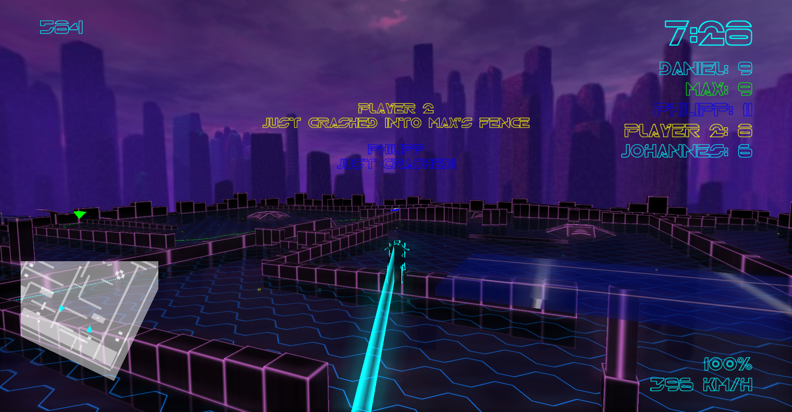
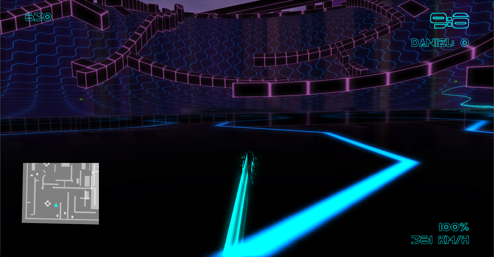

Trön
======

Trön is an action packed 3D-remake of the classic Armagetron
featuring polished graphics, customizable maps, powerups, scriptable AI, multiplayer and many more!

 **Download** the game, see more previews and view the documentation at http://gameprogramming.hpi3d.de/201314/troen/

Trailer
=======

#In Game

##Project Setup
The binaries can be downloaded at http://gameprogramming.hpi3d.de/201314/troen/, if you plan on building the game yourself here are the required steps, please file an issue, if you have trouble building the game (or want to get access to prebuilt libraries).
Contributions are always welcome!

Set up OSG:
- Copy the compiled OpenSceneGraph folder to C:\Program Files\ and create a System Variable "OSG_DIR" with the value: C:\Program Files\OpenSceneGraph
- add %OSG_DIR%\lib; %OSG_DIR%\bin to your PATH variable

Set up FMOD:
- Download fmod and copy to %ProjectDir%\3rdParty\fmod
- add the environment variable FMOD_DIR to this directory
- add %FMOD_DIR%\fmoddesignerapi\api; %FMOD_DIR%\api; to your PATH

Set up BULLET_PHYSICS:
- Download and copy bullet 2.8  to %ProjectDir%\3rdParty\BULLET_PHYSICS, dont use bullet3 as its uncompatible with the game
- no setting of any evironment variable or PATH variable necessary

Set up HIDAPI
- Download and build hidapi https://github.com/signal11/hidapi, copy to
%ProjectDir%\3rdParty\
- add %ProjectDir%\3rdParty\hidapi to your PATH

Set up V8 & Scriptzeug
- Download v8 (bin/include/lib) folder  to 
%ProjectDir%\3rdParty\
- Download and build scriptzeug https://github.com/hpicgs/libzeug, copy to %ProjectDir%\3rdParty\
- create the environment variable %V8_ROOT% and set it to %ProjectDir%\3rdParty\v8
- add the following to your path:
- %V8_ROOT%\bin
- %ProjectDir%\3rdParty\scriptzeug\lib

Set up correct Working Directory:
- in MSVC goto DEBUG->properties->ConfigurationProperties->Debugging and set WorkingDirectory to ".." (without the quotes)
